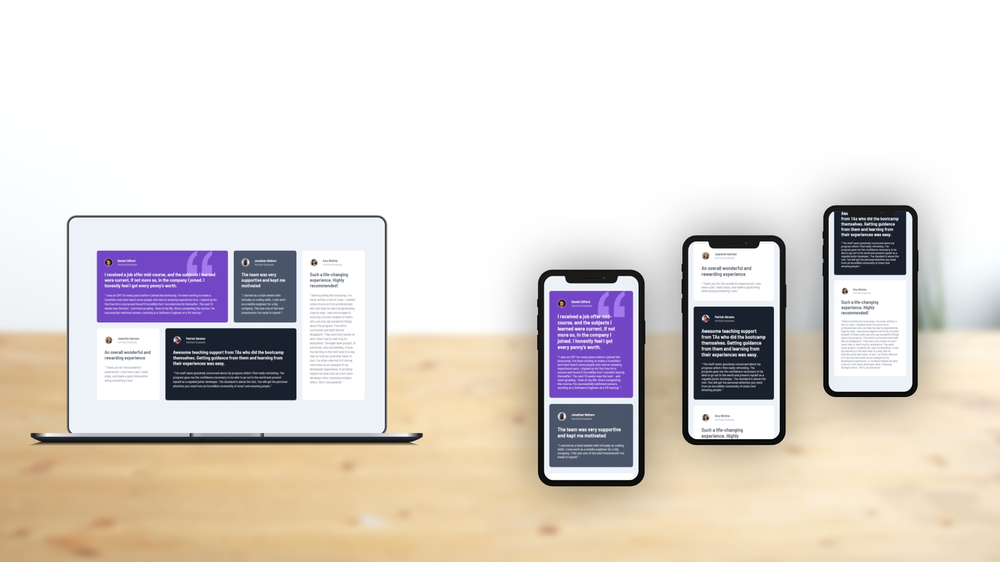

# Testimonials grid section solution

This is a solution to the [Testimonials grid section challenge on Frontend Mentor](https://www.frontendmentor.io/challenges/testimonials-grid-section-Nnw6J7Un7). Frontend Mentor challenges help you improve your coding skills by building realistic projects. 

## Table of contents

- [Testimonials grid section solution](#testimonials-grid-section-solution)
  - [Table of contents](#table-of-contents)
  - [Overview](#overview)
    - [The challenge](#the-challenge)
    - [Screenshot](#screenshot)
    - [Links](#links)
  - [Front-end Style Guide](#front-end-style-guide)
    - [Layout](#layout)
    - [Colors](#colors)
    - [Typography](#typography)
    - [Font](#font)
  - [My process](#my-process)
    - [Built with](#built-with)
  - [Author](#author)

## Overview

### The challenge

Users should be able to:

- View the optimal layout for the site depending on their device's screen size

### Screenshot

### Links

- Live Site URL: [https://benjaminvillatte.github.io/fem-testimonials-grid-section/](https://benjaminvillatte.github.io/fem-testimonials-grid-section/)

## Front-end Style Guide

### Layout

The designs were created to the following widths:

- Mobile: 375px
- Desktop: 1440px

### Colors

_Primary_

Moderate violet: hsl(263, 55%, 52%)
Very dark grayish blue: hsl(217, 19%, 35%)
Very dark blackish blue: hsl(219, 29%, 14%)
White: hsl(0, 0%, 100%)

_Neutral_

Light gray: hsl(0, 0%, 81%)
Light grayish blue: hsl(210, 46%, 95%)

Note for text colors:

1. "Verified Graduate" has the same color as the person's name with 50% opacity
2. Review paragraphs inside the quotations have the same color as well, but are at 70% opacity

### Typography

- Font size: 13px

### Font

- Family: [Barlow Semi Condensed](https://fonts.google.com/specimen/Barlow+Semi+Condensed)
- Weights: 500, 600

## My process

### Built with

- Semantic HTML5 markup
- Flexbox
- CSS Grid
- Mobile-first workflow

## Author

- Website - [Benjamin VILLATTE](https://benjaminvillatte.fr)
